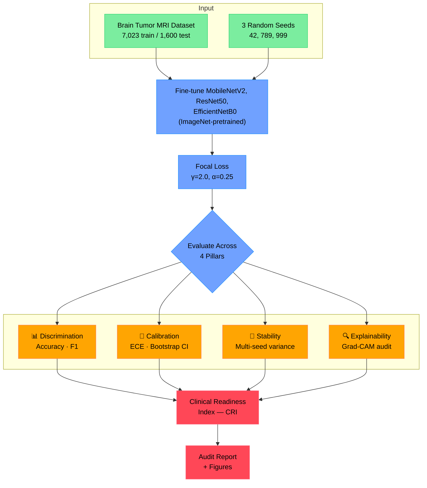

<div align="center">

# Beyond Accuracy
### A Multi-Pillar Clinical Trust Framework for Brain Tumor MRI Classification

*A 94%-accurate model can still be dangerously wrong — this framework catches the failures accuracy alone hides.*

[](.)
[](LICENSE)
[](.)
[](.)

**Authors:** Iqra Safdar · Zeeshan Raza · Malaika Arif
Department of Computer Science, COMSATS University Islamabad, Sahiwal Campus

</div>

---

## Table of Contents
- [The Problem](#the-problem)
- [The Framework](#the-framework)
- [Pipeline Overview](#pipeline-overview)
- [Methodology](#methodology)
- [Results](#results)
- [Repository Structure](#repository-structure)
- [Reproducing Results](#reproducing-results)
- [The Audit Tool](#the-audit-tool)
- [Citation](#citation)
- [License](#license)

---

## The Problem

Brain tumor MRI classifiers routinely report **94%+ accuracy**. But accuracy alone doesn't tell you whether a model is safe to deploy clinically. Two failure modes hide behind a good accuracy number:

| Failure Mode | What It Means |
|---|---|
| 🎯 **Miscalibration** | The model's stated confidence doesn't match its actual reliability |
| ⚠️ **Silent high-confidence errors** | The model is most *wrong* exactly when it claims to be most *sure* |

In our evaluation, **74.12% of MobileNetV2's wrong predictions were made with >90% confidence.** A clinician trusting the model's confidence score to flag uncertain cases would miss three out of every four errors.

## The Framework

We evaluate models across **four pillars** instead of accuracy alone, and combine them into a single deployment-readiness score.

| Pillar | What It Measures | Metric |
|---|---|---|
| **Discrimination** | Standard classification performance | Accuracy, Weighted F1 |
| **Calibration** | Does confidence match reality? | Expected Calibration Error (ECE) |
| **Statistical Stability** | Does performance hold across random seeds? | Bootstrap 95% CI, multi-seed variance |
| **Explainability** | Does the model look at the tumor, or an artifact? | Grad-CAM spatial bias audit |

These combine into the **Clinical Readiness Index (CRI)**:

```
CRI = 0.40·Accuracy + 0.25·(1 − ECE) + 0.20·(1 − HCE) + 0.15·Generalization
```

where **HCE** is the High-Confidence Error rate — the fraction of *wrong* predictions made with >90% confidence.

## Pipeline Overview



## Methodology

| Component | Detail |
|---|---|
| **Dataset** | Public Brain Tumor MRI Dataset (Nickparvar et al.) — 7,023 train / 1,600 test, 4 balanced classes (glioma, meningioma, no-tumor, pituitary) |
| **Architectures** | MobileNetV2 (3.5M params), ResNet50 (25.6M params), EfficientNetB0 (5.3M params) — all ImageNet-pretrained, final 50 layers unfrozen |
| **Class imbalance** | Focal Loss (γ=2.0, α=0.25) |
| **Optimizer** | Adam, lr=1e-4, early stopping (patience=10), ReduceLROnPlateau |
| **Statistical rigor** | 3 random seeds (42, 789, 999), bootstrap 95% CIs from 10,000 resamples, McNemar's exact test |
| **Explainability** | Grad-CAM heatmaps across **all 1,600** test images (not a hand-picked subset), quantified via edge-bias metrics |

Full details in the paper, Section III.

## Results

<div align="center">

### Multi-Seed Discriminative Performance

| Model | Accuracy | Weighted F1 | Range |
|---|---|---|---|
| ResNet50 | **94.67% ± 0.12%** | 94.55% ± 0.13% | [94.44%, 94.79%] |
| MobileNetV2 | 94.21% ± 0.21% | 94.08% ± 0.21% | [94.00%, 94.50%] |
| EfficientNetB0 | 94.04% ± 0.61% | 93.92% ± 0.53% | [93.69%, 94.75%] |

### Calibration & Confidence Safety (Seed 42)

| Model | Accuracy | ECE | HCE Rate | 95% Bootstrap CI |
|---|---|---|---|---|
| MobileNetV2 | 94.69% | 0.0479 | **74.12%** | [93.56%, 95.75%] |
| ResNet50 | 94.69% | 0.0432 | — | — |
| EfficientNetB0 | 93.69% | 0.0427 | — | — |

### Clinical Readiness Index

| Model | Acc | Cal | Safety | Gen | **CRI** |
|---|---|---|---|---|---|
| **MobileNetV2** | 0.3788 | 0.2380 | 0.0518 | 0.1500 | **0.8186** |
| ResNet50 | 0.3788 | 0.2392 | — | 0.1500 | 0.7680* |
| EfficientNetB0 | 0.3748 | 0.2393 | — | 0.1500 | 0.7641* |

*Partial CRI — HCE not yet computed for these configurations. See [open issues](#).

</div>

**Key finding:** MobileNetV2 achieves the highest CRI despite *not* having the highest raw accuracy — its 7× parameter efficiency, combined with a full four-pillar audit, makes it the preferred candidate for resource-constrained clinical deployment, provided its high-confidence error rate is mitigated through confidence thresholding or human-in-the-loop triage.

**Cross-dataset generalization:** Zero-shot transfer to an external dataset (Figshare, n=3,064) retained **86.13% accuracy** (−8.08pp), confirming reasonable domain robustness.

## Repository Structure

```
brain-tumor-clinical-trust-framework/
├── README.md
├── LICENSE
├── requirements.txt
├── train_mobilenetv2_paper_exact.py   # Training script matching the paper's exact protocol
├── generate_gradcam.py                 # Grad-CAM heatmap generation for misclassified cases
└── generalization_test.py              # Cross-dataset (Figshare) zero-shot transfer evaluation
```

## Reproducing Results

```bash
# 1. Clone the repo
git clone https://github.com/malaikaarif/brain-tumor-clinical-trust-framework.git
cd brain-tumor-clinical-trust-framework

# 2. Install dependencies
pip install -r requirements.txt

# 3. Download the Brain Tumor MRI Dataset (Nickparvar et al.) from Kaggle
#    https://www.kaggle.com/datasets/masoudnickparvar/brain-tumor-mri-dataset

# 4. Run training (GPU environment recommended — Colab/Kaggle work well)
python train_mobilenetv2_paper_exact.py

# Outputs: y_true.npy, y_pred.npy, y_pred_probs.npy, and the trained model
```

> **Reproducibility note:** Independent reruns of this protocol will not reproduce the paper's exact figures to the decimal. Table V in the paper documents seed-to-seed variance as an expected, normal property of the training process — not an error.

## The Audit Tool

This framework isn't just a paper — it's implemented as a runnable auditing tool: **MedTrust-Audit**, a FastAPI dashboard that computes the CRI and all four pillars directly from a model's saved predictions, with a working Grad-CAM explainability section and support for auditing externally-provided prediction arrays.

## Citation

If referencing this work:

```bibtex
@unpublished{safdar2026beyond,
  title   = {Beyond Accuracy: A Multi-Pillar Clinical Trust Framework for Brain Tumor MRI Classification},
  author  = {Safdar, Iqra and Raza, Zeeshan and Arif, Malaika},
  note    = {Under review},
  year    = {2026},
  institution = {COMSATS University Islamabad, Sahiwal Campus}
}
```

## License

MIT License — feel free to use and modify as needed.

---

<div align="center">
<sub>Built at COMSATS University Islamabad, Sahiwal Campus</sub>
</div>
